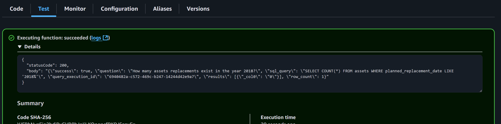
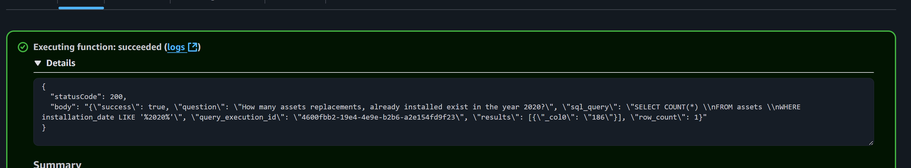
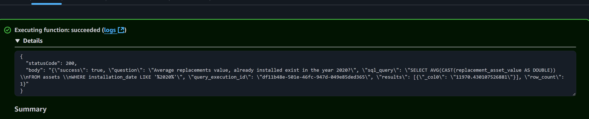
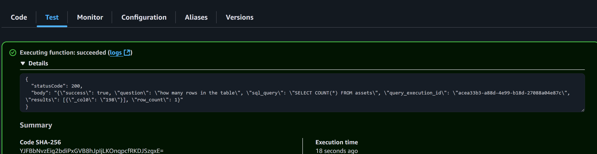

# AWS Bedrock Agent with Athena SQL Translation

A complete solution for building AI-powered SQL translation using AWS Bedrock Agent that converts natural language queries into Athena PrestoDB SQL statements.

## 🚀 Quick Start Guide

### Prerequisites
- AWS CLI installed and configured
- OpenTofu installed
- AWS account with appropriate permissions

### Step-by-Step Deployment

#### Deploy Infrastructure
```bash
# Initialize OpenTofu
tofu init

# Deploy infrastructure
tofu apply -auto-approve
```


This script will upload your CSV files to the S3 bucket for processing.

## 📁 Project Structure

```
aws-mcp-databases/
├── bedrock.tf             # Bedrock Agent configuration
├── athena.tf              # Athena workgroup and configuration
├── glue.tf                # Glue catalog and table definitions
├── s3.tf                  # S3 buckets for data storage
├── lambda.tf              # Lambda functions
├── vpc.tf                 # VPC and networking
├── knowledge-bases/       # Sample data files (Note: this project does not utilizes AWS Bedrock Knowledge Bases. This folder only contains the raw CSV data)
└── images/                # Example screenshots and visualizations
```

## 🗄️ Database Schema

The `assets` table includes the following columns (all stored as strings):
- **Tag**: Asset identifier
- **Type**: Asset type/category
- **Building**: Building location
- **Replacement_Asset_Value**: Asset replacement value
- **Installation_Date**: When asset was installed
- **Planned_Replacement_Date**: Scheduled replacement date
- **Estimated_End_of_Life**: Expected end of life
- **Remaining_Useful_Life**: Remaining useful life
- **Estimated_Replacement_Cost**: Estimated cost to replace
- **Estimated_Replacement_Date**: Estimated replacement date
- **Warranty_Expiration_Date**: Warranty end date
- **Lifetime_Maintenance_Cost**: Total maintenance cost over lifetime
- **Last_12_Months_Maintenance_Cost**: Recent maintenance costs
- **Average_Annual_Maintenance_Cost**: Average yearly maintenance
- **MC_RAV_Percentage**: Maintenance cost to replacement value ratio
- **Manufacturer**: Asset manufacturer
- **Date_Purchased**: Purchase date
- **Filter_Size**: Filter specifications
- **Vin_Number**: Vehicle identification number
- **Last_Maintenance_Date**: Most recent maintenance
- **Maintenance_Cost**: Current maintenance cost
- **Notes**: Additional information

## 🧪 Testing

### Test Bedrock Agent
1. Go to AWS Bedrock Console
2. Navigate to Agents
3. Find your lambda named  `mcp-demo-bedrock-invoke` 
4. Use a payload with the following format. 

```
{
  "question": "Average replacements value, already installed exist in the year 2020 of type HVAC?"
}
```

5.Specify whether you are looking for assets already installed or planned to be installed as we noticed that the agent confuses the installation-date and planned-installation-date. Clarification helps with the output data quality.


### Example Queries

The Bedrock Agent can handle various types of natural language queries. Here are some examples based on actual testing:

#### Asset Count and Location Queries
- "How many assets are located in FMX High School?"
- "How many unique buildings are represented in the dataset?"
- "What is the total count of assets in the dataset?"

#### Asset Type and Manufacturer Analysis
- "What is the type of all assets in the dataset?"
- "Which manufacturer appears most frequently in the dataset?"
- "Which manufacturer (with no empty values) appears most frequently in the dataset?"
- "What percentage of assets were manufactured by Trane?"

#### Date-Based Queries
- "Which building has a unit installed on 2/20/2020?"
- "How many assets have a planned replacement date after 2035?"
- "Which assets have an estimated end-of-life in 2045 but a planned replacement before 2035?"

#### Financial and Maintenance Analysis
- "What is the average replacement Asset Value of each asset?"
- "How many assets do not have a specified manufacturer?"
- "What is the average remaining useful life (in years)?"

#### Complex Asset Lookup
- "Which school has the asset with Tag '1629132 - AHU 14-ES'?"

**Note**: The agent automatically converts these natural language questions into optimized Athena SQL queries and executes them against your asset management database.

## 🔧 Troubleshooting

### Common Issues

**Agent updates require manual deletion and recreation**
- **Cause**: Bedrock Agent configuration changes often require full recreation
- **Solution**: Use the following commands:
```bash
# Delete the agent
tofu destroy --target=aws_bedrockagent_agent.athena_translator --auto-approve

# Recreate the agent
tofu apply -auto-approve
```

**Database connection failed**
- Check security group rules
- Verify credentials in Secrets Manager
- Ensure RDS is in private subnets

**Plugin error during deployment**
- **Error**: "Unrecognized remote plugin message"
- **Solution**: Run `tofu init -reconfigure` to fix plugin issues

**Deployment gets halted/interrupted**
- **Cause**: Network issues or AWS API throttling
- **Solution**: Wait a few minutes and retry `tofu apply -auto-approve`

**Data corruption or table schema issues**
- **Cause**: Corrupted data files or incorrect table schema definitions
- **Solution**: Use Terraform/OpenTofu to destroy and recreate the data infrastructure:
```bash
# Destroy the data-related resources (S3 data and Glue table)
tofu destroy --target=aws_s3_object.asset_data --target=aws_glue_catalog_table.assets --auto-approve

# Recreate the infrastructure (this will recreate the table and upload data)
tofu apply -auto-approve
```

**Note**: This process will recreate the Glue table with the correct schema and reupload your CSV data from the `knowledge-bases/` folder.

### Useful Commands

```bash
# Check current state
tofu state list

# Force reinitialize plugins
tofu init -reconfigure

# Check S3 bucket contents
aws s3 ls s3://aws-mcp-databases-knowledge-base-input-data/

# Test Athena query
aws athena start-query-execution \
  --query-string "SELECT COUNT(*) FROM assets" \
  --work-group aws-mcp-databases-workgroup
```

## 💰 Cost Optimization

### Cleanup Commands
```bash
# Delete specific resources
tofu destroy --target aws_bedrockagent_agent.athena_translator --auto-approve

# Full cleanup
tofu destroy -auto-approve
```

## 📚 Additional Resources

- [AWS Bedrock Documentation](https://docs.aws.amazon.com/bedrock/)
- [Amazon Athena Documentation](https://docs.aws.amazon.com/athena/)
- [AWS Glue Documentation](https://docs.aws.amazon.com/glue/)
- [OpenTofu Documentation](https://opentofu.org/docs/)

## 🖼️ Examples and Visualizations

### Asset Management Data Analysis

The following images demonstrate various analyses and insights from the asset management dataset:

#### Asset Replacements by Year

*Asset replacement analysis for 2018 showing distribution and patterns*


*Asset replacement analysis for 2020 with updated metrics and trends*

#### Average Asset Replacements

*Average asset replacement values and costs for 2020*

#### Data Volume Analysis

*Analysis of data volume and row counts across different asset categories*

### Data Insights

These visualizations provide insights into:
- **Asset Lifecycle Management**: Tracking installation dates, planned replacements, and end-of-life estimates
- **Cost Analysis**: Maintenance costs, replacement values, and cost-benefit ratios
- **Performance Metrics**: Asset utilization, maintenance frequency, and efficiency indicators
- **Trend Analysis**: Year-over-year comparisons and predictive maintenance planning

### Using the Data

The Bedrock Agent can help you query this data using natural language:
- "Which assets have the highest maintenance costs?"
- "Show me assets approaching their end of life"
- "What's the average replacement cost by asset type?"
- "Which buildings have the most expensive assets?"

**For more detailed statistics and query examples, see the [Example Questions](./questions/example-questions.md) file which contains comprehensive testing results including LLM-generated SQL queries, execution times, and actual results from the Bedrock Agent.**

---

**Note**: This project demonstrates best practices for building AI-powered SQL translation using AWS Bedrock Agent with Athena. The agent automatically converts natural language queries into optimized SQL statements for your asset management data.

